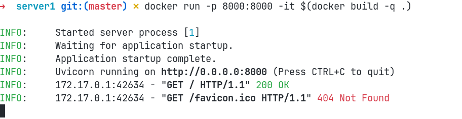
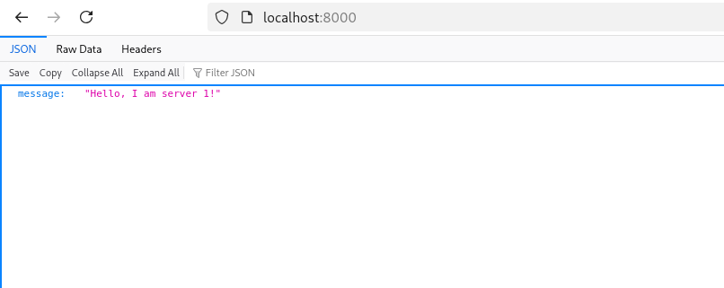
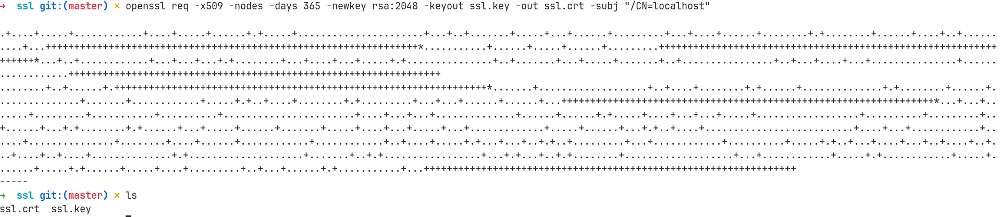
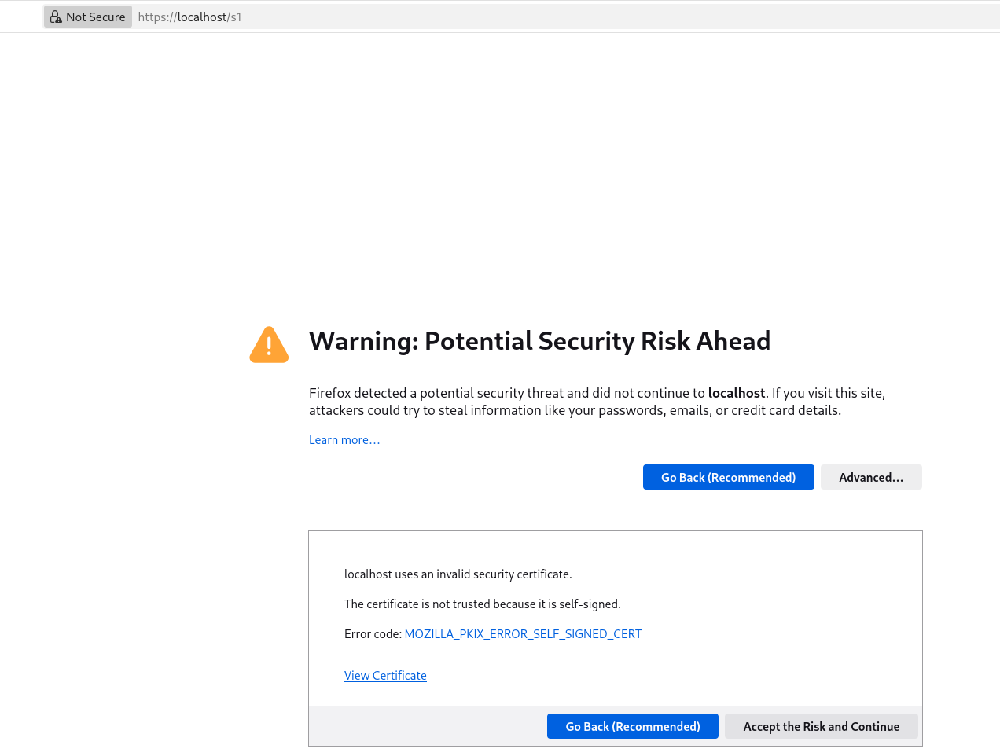
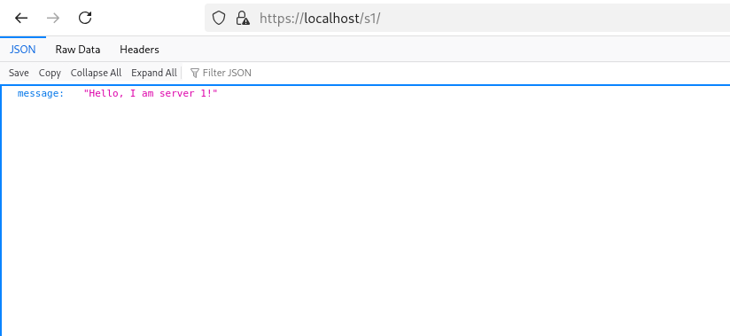
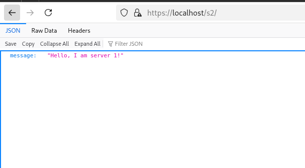
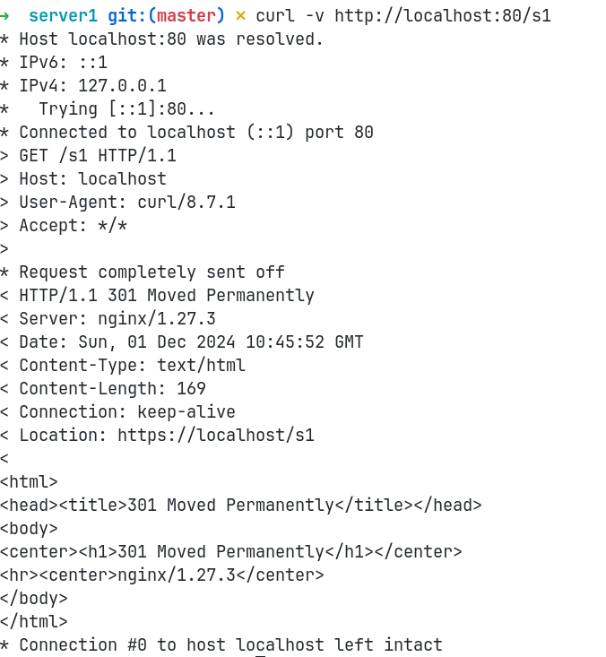

# Лабораторная работа №1

Целью работы является познакомиться с возможностями nginx в качестве прокси поверх существующих сетевых сервисов и ресурсов сервера.

Решено было делать эту лабораторную работу в сумме с докером - просто так получится воспроизводимая среда, которую преподаватель при желании мог бы протестировать самостоятельно.

## Написание приложения

Было написано два простеньких сервера на FastApi - отличаются они только отдаваемыми сообщениями. Они расположены в папках "server1/" и "server2/". Оба сервера докеризированы для воспроизводимости, простоты раскатки и чтобы в docker-compose можно было сразу положить.

Тестируется на локальном устройстве просто с помощью докера, результат:

## Написание docker-compose

Был написан [файл](./docker-compose.yml) для docker-compose. Он содержит конфигурацию серверов и nginx-прокси поверх них.
При этом порты наружу торчат только у nginx-прокси - незачем открывать внутренние порты приложения,
это дополнительный этап инкапсуляции.

## Настройка nginx

Как видно в docker-compose файле, nginx использует [папку nginx](./nginx) для подгрузки своей конфигурации.
Она создается, теперь очередь за генерацией сертификатов - генерируется сертификат, не привязанный ни к какому authority -
чисто для тестирования. Доменное имя будет использоваться localhost. Процесс генерации:

Далее создается простая nginx-конфигурация в файле [nginx.conf](./nginx/nginx.conf). Заводится два сервера, один слушает на 80 порту, другой на 443. 80 порт переадресует все на другой сервер.

Внутри https-сервера определяются локации, переадресующие на proxy. Важный момент кроется в путях - и у прокси, и у локации в конце стоит завершающий слэш("/"). Без этого возникнет ошибка на уровне сервера, что такой путь не найден - по умолчанию nginx не будет переписывать путь при передаче на прокси-upstream.

## Тест работы с серверами

Далее совершается проверка - переход в браузере на `https://localhost/s1`. При этом сразу firefox предупредил, что используется самоподписанный сертификат:

Это вполне ожидаемое поведение - мы не использовали никакого CA.

Если же принять эти условия, сервер отдаст ожидаемый результат:

Аналогично и для второго сервера:

При попытке перехода на http-версию произойдет ожидаемый редирект, протестировано с помощью curl:

## Настройка и тестирование alias

Была загружена [картинка](./nginx/assets/minion.jpg) в [папку assets](./nginx/assets/). В nginx-конфигурации была добавлена локация с alias на директорию с картинками. Директория монтируется в docker-compose. Результат ожидаемый - теперь по пути "/assets" картинка доступна напрямую:
