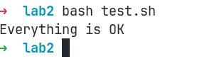

# Лабораторная работа №2

Целью работы является познакомиться с плохими и хорошими практиками в написании докерфайлов и работе с контейнерами.

## Используемое dummy-приложение

Для связи с реальным миром предположим, что наше приложение выводит содержимое некоторой help-странички.

Для простоты предположим, что эта страничка лежит в интернете по постоянному адресу. Для этого была создана простая [паста](https://pastebin.com/raw/XtGYKzjC) в pastebin.

Конечно, обращаться к страницам в сети интернет это уже само по себе плохо с точки зрения повторяемости окружения, но допустим что она действительно "отлита в граните" - как впрочем и многие установочные скрипты реального мира.

## Анти-пример

Скрипт умеет выводить содержимое странички, но ему ее нужно предоставить. Скачаем ее из сети с помощью `curl` прямо в процессе сборки контейнера.

При первой реализации может получиться анти-пример, показанный в [bad-файле](./bad.Dockerfile).

Разберем плохие практики и почему они плохи:

1. **Используется latest-образ**
   Не стоит использовать latest-версии базовых образов, потому что реальная версия может легко измениться, в результате может потеряться гарантия повторяемости конечных контейнеров. Вместо этого обычно ставят конкретную major-версию.
1. **Директива `RUN` используется для каждой shell-команды по отдельности**

   Каждая такая инвокация приводит к новому слою, раздувая размер конечного образа и увеличивая время компиляции. Поэтому обычно их сливают в одну команду.

1. **Установочный кэш зависимостей не удаляется**

   После скачивания зависимостей нужно очистить apt-кэш - он все равно больше не будет использоваться, а на размер образа повлияет.

1. **Временные зависимости не удаляются**

   Временные зависимости, использующиеся чисто для билда образа, должны удаляться по тем же соображениям - не стоит раздувать попусту конечный образ.
   Однако тут есть важный нюанс - нередко Docker-контейнеры используются интерактивно как изолированный рантайм(например, приложение `openfoam`) - тут стоит подумать, прежде чем обрубать какую-то транзитивную зависимость от конечного пользователя.

## Исправление анти-примера

После исправления вышеуказанных практик получается [подобный файл](./good.Dockerfile).

Разберем примененные исправления:

1. Используется фиксированная версия базового образа python;
1. Теперь установочные команды объединены в одну, размер конечного образа и время компиляции уменьшились;
1. Установочный кэш и временные зависимости подчищаются.

Для проверки, что выводы контейнеров обоих файлов совпадают, был создан [тест-файл](./test.sh).
Он проверяет, что вывод контейнеров совпадает друг с другом и с конечным help-сообщением.

Результат проверки:

## Плохие практики в работе с контейнерами

Запороть работу даже с правильно построенным контейнером несложно. Несколько плохих практик:

1. **Использовать привилегированный режим работы**

   Его можно запустить при передаче `--priveleged` флага. Он дает полноценный доступ к хост-системе для контейнера.
   Это по сути нарушает концепцию контейнеров в целом. Почему оно вообще существует? Для поддержки экзотических кейсов вроде DinD(Docker-in-Docker).

   Лучше давать настолько минимальный доступ к системе, насколько возможно.
   Если нужен какой-то специфичный доступ, можно воспользоваться `capability` - у системы есть целый список из подобных узких возможностей, например `CAP_NET_ADMIN`, дающей доступ к управлению сетью устройства.
   Для добавления capability можно использовать опцию `--cap-add`.
   Подобная практика, к слову, справедлива и для `systemd`-сервисов.

1. **Хранить данные внутри контейнера напрямую**

   Причина понятна - контейнеры должны быть в идеале stateless, поскольку их удаление и пересоздание - очень частые операции.

   Особенно важно это избегать в контейнерах, которые создаются в качестве пользовательского рантайма - велик соблазн записать какие-то промежуточные изменения в файл.

   Избежать этого помогут `volumes` и `mounts` - можно примонтировать локальную директорию хоста внутрь контейнера.

## Вывод

В ходе выполнения были рассмотрены плохие практики по написанию докерфайлов, в результате они были показательно исправлены.
Конечные контейнеры были протестированы на эквивалентность работы.
Также были рассмотрены плохие практики при работе с уже готовыми контейнерами - в том числе были даны советы по их исправлению.
При выполнении работы проблем не возникло.
