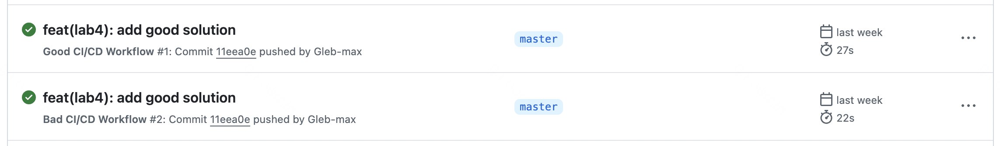
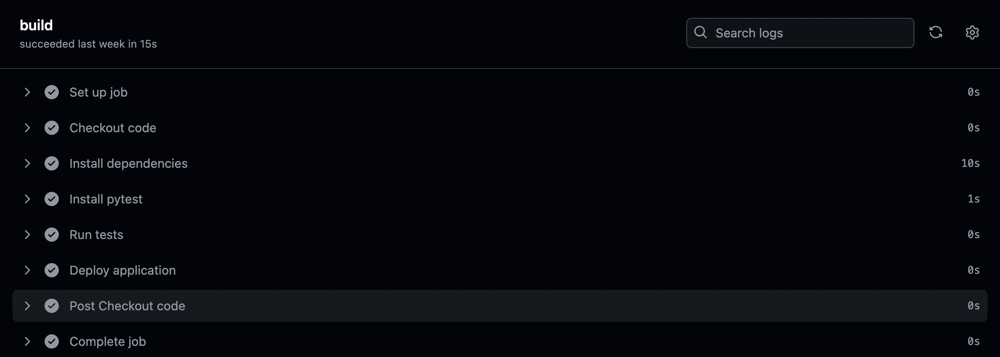
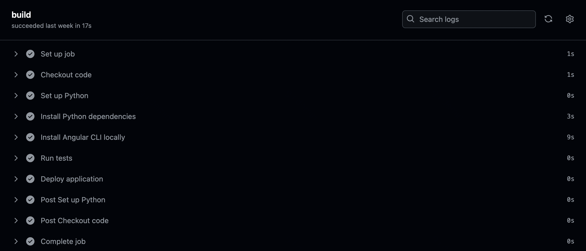

# Лабораторная работа №4

В данной работе были написаны два файла CI/CD: первый демонстрирует примеры плохих практик, второй - примеры хороших практик. 
Целью работы было наглядно показать отличия между практиками и объяснить, что можно использовать в процессе настройки CI/CD, а что - нет.

## Пример использования плохих практик ("антипаттернов")
Ниже представлен код, использующий плохие (чаще всего ненадёжные и неэффективные) практики. Разберём его подробнее.
```
name: Bad CI/CD Workflow

on: [push, pull_request]

jobs:
  build:
    runs-on: ubuntu-latest

    steps:
      - name: Checkout code
        uses: actions/checkout@v2

      - name: Install dependencies
        run: |
          pip install -r requirements.txt || true
          npm install -g @angular/cli

      - name: Install pytest
        run: pip install pytest

      - name: Run tests
        run: pytest || echo "Tests failed"

      - name: Deploy application
        run: |
          echo "Deploying to production"
          echo "Pretend to connect and deploy to server"
```
### Устаревшая версия actions/checkout
```
- name: Checkout code
        uses: actions/checkout@v2
```
Достаточно очевидная ошибка, нарущающая целостность любого конфигурационного или программного файла - использование устаревших версий. 
В нашем случае используется checkoutv2, в котором всё ещё могут быть не учтены ошибки, исправленные в checkoutv3. 
В нашем коде не используются многие привелегии checkoutv3, так как он максимально тестовый, однако это всё равно можно включить в минусы использования checkoutv2.  
P.S. данный пункт плохих практик можно применить и более масштабно: вредно использовать любые старые версии вспомогательных инструментов, если иное не учтено в проекте!
### Глобальная установка зависимостей
```
npm install -g @angular/cli
```
Тут всё тоже достаточно очевидно: глобальная установка зависимостей может привести к конфликтам версий, особенно если в вашем проекте уже есть другие зависимости, 
которые могут использовать разные версии одной и той же библиотеки. 
Это еще и затрудняет поддержку проекта, потому что становится неясно, какие версии в итоге используются приложением.
### Установка pytest отдельно от основного requirements.txt
```
- name: Install pytest
  run: pip install pytest
```
Разделять зависимости в CI/CD - также не самый лучший подход. 
Конечно можно проводить установку всех библиотек чисто через .yml файл, не обращаясь к текстовому файлу, 
хранящему список необходимых инструментов, однако если всё-таки решено было использовать подобный файл, 
крайне неэффективно разделять установки библиотек таким способом: что-то пихаем в yml, что-то пихаем в .txt. 
Всем участником проекта будет удобнее и спокойнее, если за установки вспомогательных библиотек будет отвечать один отведенный файл.
### Игнорирование ошибки в тестах
```
- name: Run tests
  run: pytest || echo "Tests failed"
```
Ну, думаю, тут объяснять особо нечего. Тесты нужны нам для понимания того, что проект работает исправно и игнорировать тесты - неэффективно и странно. 
Конечно в жизни любого программиста однажды наступает соблазн проскипать тест, который по какой-то причине фейлится, 
но всё-таки рекомендуется относится к этому стоически и не игнорировать тесты, а искать эффективные решения.
### Развертывание без условий
```
- name: Deploy application
  run: |
    echo "Deploying to production"
    echo "Pretend to connect and deploy to server"
```
Развертывание без условий - ещё одна распространённая ошибка. Подобное действие равносильно тому, чтобы прыгнуть в бассейн, не проверив, есть ли в нём вода. 
Развертывание без подтверждения того, что предыдущие шаги прошли успешно, может привести к тому, что на продакшн пойдет код с ошибками, что просто неразумно и неэффективно. 
Пользователям грустно, разрабам грустно, всем грустно в общем.

## Пример использования хороших практик
Ниже представлен код, использующий хорошие практики, по-сути исправляющий написанный раннее файл плохих практик. Разберём его подробнее.
```
name: Good CI/CD Workflow

on: [push, pull_request]

jobs:
  build:
    runs-on: ubuntu-latest

    steps:
      - name: Checkout code
        uses: actions/checkout@v3

      - name: Set up Python
        uses: actions/setup-python@v4
        with:
          python-version: '3.x'

      - name: Install Python dependencies
        run: pip install -r lab4/requirements.txt

      - name: Install Angular CLI locally
        run: npm install @angular/cli

      - name: Run tests
        run: pytest lab4/tests/

      - name: Deploy application
        if: success()
        run: |
          echo "Deploying to production..."
          echo "Pretend to connect and deploy to server" 

```
### Использование актуальной версии действия checkout
```
- name: Checkout code
  uses: actions/checkout@v3
```
Верным решением будет заменить использование checkout@v2 на checkout@v3, так как это гарантирует использование последней версии с исправлениями и улучшениями (ура!). 
Подобное изменение действительно важно, потому что обновления часто содержат исправления для известных ошибок, 
а также добавляют новые функции (GITHUB_TOKEN и кэшировение функций), которые могут облегчить разработку и поддержание проекта. 
### Локальная установка зависимостей
```
- name: Install Angular CLI locally
  run: npm install @angular/cli
```
Далее была исправлена глобальная установка зависимостей. Зависимости были установлены локально, что уменьшает риск конфликтов версий и делает проект более устойчивым к изменениям. 
Такой подход помогает сохранить окружение разработки чистым и управляемым, поскольку каждая установка зависит от конкретного проекта и его конфигурации, а не от глобальных настроек системы.
### Установка pytest через requirements.txt
```
- name: Install Python dependencies
  run: pip install -r lab4/requirements.txt
```
Далее была исправлена ошибка, связанная с отдельной установкой некоторых библиотек (при наличии файла requirements.txt). 
Теперь все зависимости, включая pytest, указаны в одном файле requirements.txt, что упрощает процесс установки и управления зависимостями. 
Во-первых, это делает код более организованным, а во-вторых - это снижает риск несоответствий между разработкой и рабочей средой. 
По итогу все участники проекта могут быть уверены, что работают с одинаковым набором библиотек.
### Обработка ошибок в тестах
```
- name: Run tests
  run: pytest lab4/tests/
```
Верным решением по отношению к тестам будет не игнорировать их, а смотреть, что же пошло не так. Пусть лучше мы сейчас всё починим, чем потом всё упадёт и все будут злится.
### Условия для развертывания
```
- name: Deploy application
  if: success()
  run: |
    echo "Deploying to production..."
    echo "Pretend to connect and deploy to server"
```
Ну и напоследок - теперь развертывание происходит только в случае успешного прохождения всех предыдущих шагов (благодаря условной строке if: success()). 
Установка условий для развертывания помогает минимизировать риски возникновения ошибок в продакшене, уберегая нас от грустного фидбека дорогих пользователей.

### Пайплайны
Пайпы запускаются:


Плохой пайп выглядит так:


Хороший - так:


## Вывод

В данной лабораторной работе мной были рассмотрены примеры плохих практик в настройке CI/CD, после чего все допущенные ошибки были исправлены, объяснены приемущества "хороших практик". 
Оба .yml файла были успешно протестированы. 
